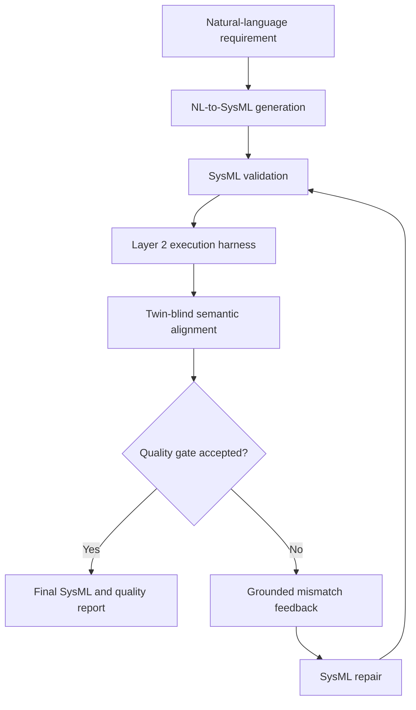

# Spec mismatch system design

## Audit result

Creatix's branch contains both requested pieces:

- A versioned question bank with 45 universal questions and, after consolidation,
  40 concrete templates. Templates cover sample-specific entities, containment,
  connections, values, units, bounds, requirements, states, actions, item/signal
  types, multiplicity, events, calculations, verification, use cases, allocation,
  traceability, and distractors.
- An end-to-end twin-blind process that instantiates questions, answers the same
  questions independently from NL and SysML, scores answer agreement, and emits
  localized mismatch records with evidence.

The original implementation was a standalone research CLI. It did not call the
translator, syntax checker, or Layer 2 execution harness, and it did not perform
model repair. Its question writer also saw both modalities, which is useful for
offline error analysis but leaks candidate information into a production test set.

## Placement

Spec alignment belongs after Layer 2 in each quality-loop iteration:



This ordering makes alignment the semantic acceptance gate while ensuring every
repaired candidate is revalidated and re-executed. Alignment should not be placed
inside Layer 2 because it evaluates requirement fidelity, not runtime semantics.

## Profiles

`research` preserves Creatix's deep-coverage instrument: all 45 universal questions
plus 30-60 questions instantiated from the union of NL and SysML. Use it for dataset
evaluation, calibration, and paper results.

`runtime` uses 11 broad canary/category questions plus 8-16 concrete questions
instantiated from NL only. Candidate SysML is never shown to the question writer.
This is the translator-facing default: fewer calls, no candidate-conditioned test
selection, and direct coverage of facts the generated model is expected to preserve.

## Runtime contract

Generation order after MoE synthesis is:

1. Compiler refine
2. Kernel execution refine (`KERNEL_FEEDBACK_ENABLED`, default on for CLI/batch)
3. Spec-mismatch semantic alignment via `run_quality_gate` (combiner repair)

After every semantic repair, the gate re-runs full compiler validation and kernel
execution. A repaired candidate is kept only when similarity strictly improves and
neither validation nor execution status regresses relative to the current best
candidate; otherwise the pre-repair model is retained.

```python
from nl2sysml.quality_gate import layer2_executor, run_quality_gate

result = run_quality_gate(
    natural_language,
    generated_sysml,
    ask=answer_json_with_llm,
    validate=validate_sysml,
    execute=layer2_executor,  # re-check kernel after each repair
    repair=repair_sysml_with_llm,
    threshold=0.85,
    max_repairs=1,
)
```

The agentic FastAPI pipeline exposes the same path behind environment flags:

```env
SPEC_ALIGNMENT_ENABLED=true
KERNEL_FEEDBACK_ENABLED=true
SPEC_ALIGNMENT_PROFILE=runtime
SPEC_ALIGNMENT_THRESHOLD=0.85
SPEC_ALIGNMENT_MAX_REPAIRS=1
SPEC_ALIGNMENT_SHARDS=3
```

The FastAPI `SPEC_ALIGNMENT_ENABLED` flag defaults to `false`, preserving interactive latency unless the
deployment explicitly enables the gate. Kernel feedback defaults to `true` when the SysML
kernel is available (`KERNEL_FEEDBACK_ENABLED`, disable with `--no-kernel-feedback`).
When kernel feedback is enabled, the quality gate also re-executes repaired candidates
through Layer 2. The command-line and batch generator enable
spec alignment by default because those paths produce the regenerated research
artifacts; pass `--no-spec-alignment` or set `SPEC_ALIGNMENT_ENABLED=false` to run the
legacy generation path. `LLM_BACKEND` defaults to `api` (OpenRouter HTTP), which
carries the whole expert set — `z-ai/glm-5.2` (combiner),
`deepseek/deepseek-v4-pro`, `qwen/qwen3.8-max`, `meta-llama/llama-4-maverick`.
Pass `--llm-backend cli` or set `LLM_BACKEND=cli` for the local Claude Code /
Codex transport; it only takes effect for `anthropic/*` and `openai/*` models,
which are no longer in the default set.

The result records every attempt, validation and execution status, alignment report,
whether each repair was kept, final SysML (best retained candidate), repair counts,
and acceptance decision. Unavailable infrastructure is
reported as `unavailable`; it never produces fake success and is not sent to the LLM
as if code repair could fix it.

## Acceptance policy

A candidate is accepted only when:

1. Validation passed or was intentionally skipped.
2. Layer 2 passed or was intentionally skipped.
3. Similarity meets the configured threshold.
4. The domain canary does not indicate a wrong-system pairing.
5. Distractor reliability does not flag an untrustworthy answer set.

Repair retention is stricter than acceptance: a repaired model must improve similarity
and must not worsen compiler or kernel status versus the current best, even if the
gate ultimately remains unaccepted.

Research scores remain continuous and category-level. Runtime acceptance is a gate
on top of that score, not a replacement for the detailed report.

## Remaining empirical work

The deterministic tests verify orchestration, parsing, scoring, dependencies,
caching, and repair-loop behavior. The seeded dataset test in Creatix's original
code uses stub answers, so it does not validate real LLM answer accuracy. Before
claiming an evaluation result in the paper, keep a hand-labeled golden set and run
real perturbations such as deleting a connection, changing a bound, reversing a
flow, removing a required part, and renaming or redirecting a state transition.

## Multi-language banks (SysML v2 and Solidity)

The aligner is language-parameterized. A bank declares its own model side:

```json
"language": {"id": "solidity", "label": "Solidity smart contract source",
             "display": "Solidity", "fence": "solidity", "artifact_noun": "contract"}
```

Banks written before this block existed default to SysML, so `questions.json`,
its reports, and every existing consumer are unchanged — the model-side answer
key stays `sysml` there and becomes `solidity` in the Solidity bank.

`language.id` selects: the answerer prompt's document label and code fence, the
model-side worldview (`model_answerer_worldview`, falling back to
`sysml_answerer_worldview`), the origin vocabulary given to the question writer,
the answer-set key in `score`/`report` (`data["model_key"]`), and the wording of
`build_repair_prompt` — which previously asked for "corrected SysML v2 text"
regardless of what was being repaired.

Select a bank with `compare_pair(..., bank_path=...)`, or `--language solidity`
on the CLI. `nl2solidity/quality_gate.py` defaults to the Solidity bank.

### Solidity bank

`questions_solidity.json` — 45 universal questions, 36 templates, 3 distractors.
Category coverage follows construct frequency measured over the 1500 contracts in
`nl2solidity/dataset` (function 94.5%, view/pure 79.4%, state variable 71.1%,
require/revert 65.1%, inheritance 55.1%, constructor 46.2%, external call 31.7%,
event 30.0%, payable 26.4%, time 18.2%, access control 17.7%, upgradeable 13.8%),
the same way the SysML bank's weights came from its 1935 gold models.

Categories: global (canary), interface, state, access, value, accounting, events,
validation, lifecycle, composition, time, safety, classification. `U-GLB-01` is
kept as the domain-canary id because `score.py` special-cases it.

Two Solidity-specific rules carry most of the semantic weight:

- **Inheritance counts.** `contract X is ERC20, Ownable` provides `transfer` and
  owner-gated access even though those bodies are not in the file. Corpus samples
  are single files without their imports, so the closed-world answerer is told to
  judge the deployed contract including what it inherits, from the base names.
- **Permission, failure, and value are read semantically**, not lexically: a
  modifier, an explicit `msg.sender` check, or an inherited access-control base
  all count as restricting a function; `require`, `revert CustomError()`, and a
  reverting modifier all count as rejecting invalid input.

The runtime profile names its 11 questions in `profiles.runtime.universal_ids`
rather than the hardcoded SysML set in `pipeline.py`.
